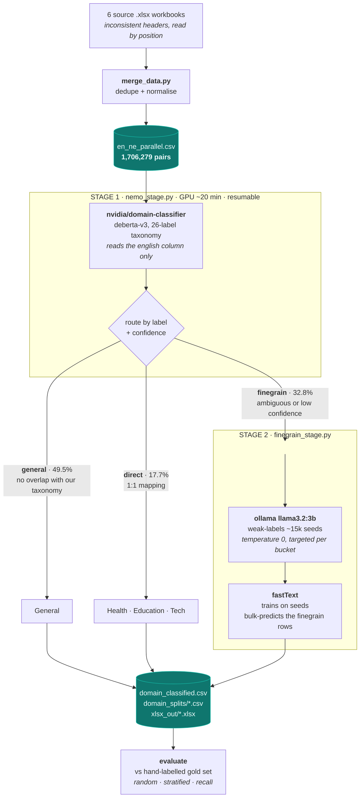

# NLTM Domain Classifier

Splits a ~1.7M-pair English–Nepali parallel corpus into nine domains, so NMT
models can be trained on domain-stratified data instead of one flat mix.

Two stages: NVIDIA's pretrained domain classifier answers the two thirds of
the corpus it can answer cheaply, and an LLM-seeded fastText classifier
handles the ambiguous third using a taxonomy NVIDIA's model doesn't have.

Classification only ever reads the **English** side. The Nepali side is
carried through untouched, so every output file is still a usable parallel
training set.

---

## Contents

- [Why two stages](#why-two-stages)
- [Taxonomy](#taxonomy)
- [Architecture](#architecture)
- [Technique notes](#technique-notes)
- [Results](#results)
- [Install](#install)
- [Usage](#usage)
- [Outputs](#outputs)
- [Evaluation](#evaluation)
- [Performance](#performance)
- [Known issues](#known-issues)

---

## Why two stages

The obvious approaches both fail on this corpus:

**Just use NVIDIA's classifier.** `nvidia/domain-classifier` is good, free and
pretrained — but its 26-label taxonomy is built for general web content and
has **no label for Agriculture, Climate, Tourism or Admin**, which are four of
the nine domains this project needs. Those four only exist inside buckets that
mean something broader: `Science` contains Climate but also ordinary science,
`Business_and_Industrial` contains Agriculture but also general industry,
`Law_and_Government` covers both Admin and Law without separating them. A
26→9 mapping would be guesswork precisely where it matters.

**Just train a classifier on the nine domains.** There's no labelled training
data, and hand-labelling enough of it is the expensive thing we're trying to
avoid.

So: let NVIDIA's model answer what it can answer confidently, and only spend
effort on the rest.

- **~49.5%** of rows get a NeMo label with no overlap with our taxonomy at all
  (Sports, Shopping, Games, Finance, Adult…). These become `General` directly.
  No second model needed, and no risk of a keyword-driven classifier inventing
  an "Agriculture" reading of a football report.
- **~17.7%** get a label that maps 1:1 (`Health`→Health,
  `Jobs_and_Education`→Education, `Computers_and_Electronics`→Tech,
  `Internet_and_Telecom`→Tech). Final, no second model needed.
- **~32.8%** are genuinely ambiguous — the label straddles two of our domains,
  or the model wasn't confident. Only these go to stage 2.

The payoff: stage 2 only has to be good at a third of the corpus, and that
third is a *concentrated* population where the rare domains actually live.

---

## Taxonomy

| Domain | Covers | Example |
|---|---|---|
| Tech | Software, computers, internet, electronics | "The application requires a stable internet connection." |
| Agriculture | Farming, crops, livestock, food production | "Farmers in the hills cultivate millet and buckwheat." |
| Climate | Weather, environment, climate change, disasters | "The monsoon season brings heavy rainfall to the region." |
| Tourism | Travel, tourism, culture, heritage sites | "Pokhara is known for its scenic lakeside views." |
| Admin | Government notices, official documents, administration | "The committee shall submit the report within 30 days." |
| Health | Medical, health advisories, nutrition, disease | "Wash hands frequently to prevent the spread of infection." |
| Law | Legal text, legislation, court, rights | "Every citizen has the right to a fair trial." |
| Education | Schools, curriculum, academic content, training | "The textbook covers the fundamentals of arithmetic." |
| General | News, miscellaneous, conversational, fits nothing above | "The event was attended by hundreds of people." |

---

## Architecture



<details>
<summary>Same thing as plain text</summary>

```
  6 source .xlsx workbooks  (inconsistent headers, read by position)
            |
            v  merge_data.py
  en_ne_parallel.csv            1,706,279 pairs after dedupe
            |
            v  nemo_stage.py          [GPU, ~20 min, resumable]
  nvidia/domain-classifier (deberta-v3) over the english column
            |
            +-- route=general    49.5%  no overlap  ---------> General  (final)
            +-- route=direct     17.7%  1:1 mapping ---------> domain   (final)
            +-- route=finegrain  32.8%  ambiguous / low conf
                      |
                      v  finegrain_stage.py       [stage 2]
              ollama llama3.2:3b labels ~15k seed sentences
                      |                 (weak supervision, temperature 0)
                      v
              fastText trains on seeds, bulk-predicts the finegrain rows
                      |
                      v
  domain_classified.csv  +  domain_splits/*.csv  +  xlsx_out/*.xlsx
```

</details>

Stage 1 writes a parquet checkpoint every 50k rows, so it is interruptible and
resumable; stage 2's seeding appends per line for the same reason. Every step
accepts `--budget <minutes>` and stops cleanly, which matters when the GPU is
also being used for something else.

---

## Technique notes

The parts that are load-bearing, and why.

### LLM-seeded weak supervision

There is no hand-labelled training data for the nine domains, so a local LLM
(`llama3.2:3b` via ollama) labels a few thousand sentences and fastText trains
on *those* labels. The LLM never touches the corpus at scale — at ~0.09 s/call
on a GPU, labelling 560k rows directly would take ~14 hours, versus seconds for
fastText. The LLM buys labels; fastText does the work.

This is a known-sound pattern: models fine-tuned on LLM-generated labels
perform comparably to those trained on human annotations
(Pangakis & Wolken, ACL 2024, `2024.nlpcss-1.9`).

The hand-labelled gold set is kept entirely separate and never trained on.

### Measure your teacher before you scale it

The single largest quality problem in this pipeline was not the student model,
the features, or the amount of data. It was that the teacher was being sampled
at ollama's **default temperature of 0.8** for what is a deterministic
classification task.

Asked the same sentence twice, `llama3.2:3b` gave:

| Decoding | Self-agreement |
|---|---|
| default (temperature 0.8) | **56.7%** |
| temperature 0 | **95.8%** |

So roughly 40% of the seed labels were sampling noise. fastText then scored
macro-F1 **0.424** in 5-fold cross-validation against those labels — which is
close to the ceiling that noise permits, not a failure of fastText. Tuning the
student would have been wasted effort.

**Self-consistency is a cheap upper bound on what weak supervision can
deliver, and it should be measured before generating a single seed.** Re-ask a
sample of sentences and count how often the teacher agrees with itself; the
student cannot reliably exceed that. It takes a couple of minutes and would
have saved an entire seeding run here.

Generalisable rules this produced, all now in `config.py`:

- `temperature: 0` for any classification or extraction prompt.
- `num_predict` capped to the shortest useful output.
- `keep_alive` set so the model isn't reloaded per call.

### Targeted seeding — the part that actually mattered

A uniform random sample of the corpus is close to useless for the rare
domains. 1,732 randomly sampled sentences yielded **17 Climate** and 26
Agriculture seeds. fastText cannot learn a class from 17 examples.

The fix (`seed_targeted`) samples **per NeMo bucket** rather than uniformly —
`Science` for Climate candidates, `Business_and_Industrial` + `Food_and_Drink`
for Agriculture, `Travel_and_Transportation` for Tourism, `Law_and_Government`
for the Admin/Law split.

| | random only | after targeted |
|---|---|---|
| total seeds | 1,732 | 14,996 |
| Climate | 17 | 313 |
| Agriculture | 26 | 806 |
| Tourism | 90 | 887 |

There's a second reason this is right, beyond yield: fastText *only ever sees
finegrain rows at inference*, and those come from exactly these buckets. So
seeding from them matches the training distribution to the inference
distribution, rather than training on a corpus-wide sample the model will
never see.

Useful yield rates for topping up: ~7% of `Science` rows come back Climate,
~10% of the industrial/food buckets come back Agriculture.

### Length-sorted batching

Sentences average 19 tokens but p99 is 50. With `padding="longest"`, a random
batch of 64 pads every short sentence out to the batch maximum, so most of the
compute is spent on padding. Sorting by length before batching and restoring
the original order afterwards is **~2x** (25 → 50 sent/sec on CPU) and changes
nothing about the output.

### The model-loading trap

`nvidia/domain-classifier` is **not** an `AutoModelForSequenceClassification`.
It's a DeBERTa backbone plus a custom `fc` head, published via
`PyTorchModelHubMixin`. Loading it with the Auto class appears to work — it
emits only the usual missing-weights warnings — but silently initialises the
classifier head *randomly*, giving confident-looking garbage. `CustomModel` in
`nemo_stage.py` matches the real architecture.

The checkpoint is also mixed precision (fp16 backbone, fp32 head), which
raises `mat1 and mat2 must have the same dtype` unless you force one dtype:
fp16 on GPU, fp32 on CPU.

### Don't quantize

int8 dynamic quantization looks attractive for CPU inference (~1.4x) and
**destroys this model**: mean confidence drops 0.93 → 0.31 and ~90% of rows
collapse into `Arts_and_Entertainment`. Measured on 600 rows. `QUANTIZE_ON_CPU`
exists in `config.py` only so the finding is recorded next to the switch.

### Bulk prediction

`model.predict(list_of_sentences)` — passing the whole list — is orders of
magnitude faster than looping one sentence at a time. Looping is the single
easiest way to turn a 30-second step into an hours-long one.

### UTF-8 BOM on every CSV

The Nepali side is Devanagari and these files get opened in Excel on Windows,
which assumes the system ANSI codepage unless a BOM is present — producing
mojibake across the entire Nepali column. Every CSV is written `utf-8-sig`.
`fix_csv_bom.py` repairs existing files by byte-level prepend.

---

## Results

Full run over 1,706,279 pairs. Stage 1 mean confidence 0.919; 9.0% of rows
fell below the 0.6 threshold and were routed to stage 2 regardless of label.

| Domain | Pairs | Share |
|---|---|---|
| General | 931,708 | 54.60% |
| Tech | 260,499 | 15.27% |
| Admin | 157,376 | 9.22% |
| Health | 124,399 | 7.29% |
| Education | 121,080 | 7.10% |
| Law | 56,973 | 3.34% |
| Tourism | 38,109 | 2.23% |
| Agriculture | 13,180 | 0.77% |
| Climate | 2,955 | 0.17% |

### Stage 2 classifier quality

`evaluate_seeds.py`, 5-fold stratified cross-validation over the 15,048 seed
sentences:

| | accuracy | macro-F1 |
|---|---|---|
| **current** | **0.591** | **0.574** |

Per class:

| Domain | Precision | Recall | F1 | Support |
|---|---|---|---|---|
| Tech | 0.672 | 0.735 | 0.702 | 4,563 |
| Climate | 0.798 | 0.574 | 0.668 | 282 |
| Agriculture | 0.699 | 0.673 | 0.686 | 878 |
| Health | 0.614 | 0.560 | 0.586 | 1,374 |
| General | 0.515 | 0.540 | 0.527 | 2,141 |
| Tourism | 0.566 | 0.481 | 0.520 | 928 |
| Education | 0.515 | 0.497 | 0.506 | 1,552 |
| Admin | 0.479 | 0.521 | 0.499 | 2,631 |
| Law | 0.523 | 0.398 | 0.452 | 699 |

How it got there — two changes, both worth more than any modelling idea:

| Change | macro-F1 | Gain |
|---|---|---|
| baseline (temperature 0.8, `dim=50 epoch=10 wordNgrams=2`) | 0.424 | — |
| teacher decoding at `temperature=0` | 0.503 | **+0.079** |
| fastText hyperparameters from autotune | **0.574** | **+0.071** |

**+0.150 macro-F1, +35% relative, from two parameter fixes.**

### What these numbers are and are not

The table above measures **fidelity to the `llama3.2:3b` seed labels** — how
faithfully fastText reproduces its teacher on held-out sentences. It is a real
and useful number: it catches unlearnable classes, shows which domains bleed
into each other, and proved both fixes above. It is **not corpus accuracy**,
because the labels are weak supervision from a 3B model rather than ground
truth.

Two things follow that are easy to get wrong:

- A high score here would not prove the pipeline is accurate — it could mean
  fastText faithfully reproduced a systematic error of the teacher.
- The current 0.574 does not prove it is *inaccurate* either. A student that
  smooths an idiosyncratic teacher can be more accurate than the teacher.

Only the hand-labelled gold set settles it. See
[Evaluation](#evaluation).

---

## Install

```bash
git clone <this repo>
cd nltm-domain-classifier
python -m venv venv
venv\Scripts\activate          # linux/mac: source venv/bin/activate
pip install -r requirements.txt
```

**GPU strongly recommended.** A plain `pip install torch` gets the CPU-only
wheel on Windows, which makes stage 1 ~28x slower. For CUDA:

```bash
pip install torch --index-url https://download.pytorch.org/whl/cu126
python -c "import torch; print(torch.cuda.is_available())"   # must print True
```

**Ollama** is a separate install from the Python client, needed only for
seeding:

```bash
winget install Ollama.Ollama        # or https://ollama.com/download
start_ollama.cmd                     # project-local model storage
ollama pull llama3.2:3b
```

Point the code at your data (defaults to the current directory):

```bash
set NLTM_DATA_DIR=E:\path\to\data          # windows
export NLTM_DATA_DIR=/data/nltm             # linux/mac
```

### Try it without the corpus

The real corpus isn't redistributable, so a small synthetic sample is included
to verify the pipeline runs:

```bash
python sample_data/make_sample.py
mkdir %NLTM_DATA_DIR%\data_raw
copy sample_data\*.xlsx %NLTM_DATA_DIR%\data_raw\
python merge_data.py
python domain_classifier_nltm.py all
```

45 made-up pairs spanning all nine domains, deliberately written into two
workbooks with *different* column headers to exercise the merge. It smoke-tests
the plumbing — accuracy on 45 rows is meaningless.

---

## Usage

```bash
python domain_classifier_nltm.py status             # progress, no GPU needed
python domain_classifier_nltm.py probe              # keyword sanity check
python domain_classifier_nltm.py stage1 --budget 30 # NeMo pass, resumable
python domain_classifier_nltm.py seed               # random seeding
python domain_classifier_nltm.py seed-targeted      # per-bucket seeding
python domain_classifier_nltm.py finish             # stage 2 + splits
python domain_classifier_nltm.py evaluate           # vs the gold set
python domain_classifier_nltm.py all --budget 60    # everything
```

Gold set:

```bash
python make_gold_set.py        # build it
python label_gold.py            # keypress labeller, 1-9, resumable
python domain_classifier_nltm.py evaluate
```

Excel export:

```bash
python export_xlsx.py                   # per-domain workbooks
python export_xlsx.py --chunks           # whole corpus in corpus order
python export_xlsx.py --rows 50000       # smaller parts
python export_xlsx.py --domain climate   # one domain
```

Every long step takes `--budget <minutes>` and stops cleanly; re-run to
continue from where it stopped.

---

## Outputs

| Path | What |
|---|---|
| `en_ne_parallel.csv` | merged corpus, deduped |
| `stage1_out/chunk_*.parquet` | stage 1 checkpoints — internal, resumable, incomplete by design (finegrain rows have no domain yet) |
| `labeled_seed.txt` | LLM-labelled seeds, fastText format |
| `domain_classifier.bin` | trained fastText model |
| `domain_classified.csv` | every row with its final domain |
| `domain_splits/*.csv` | one CSV per domain — **the canonical deliverable** |
| `xlsx_out/*.xlsx` | per-domain workbooks, 100k-row parts |
| `xlsx_out/chunks/*.xlsx` | whole corpus in original order, 100k-row chunks |

Every row carries `id, english, nepali, source_file, nemo_label, nemo_score,
route, domain, confidence`.

Excel files have **data on sheet 1 and run metadata on sheet 2** — source
provenance, both stage configs, seed counts, routing split, domain
distribution, column meanings and caveats. They're split into 100k-row parts
(~11 MB) because a single 938k-row workbook takes minutes to open and is easy
to corrupt on save.

---

## Evaluation

A flat random sample **cannot** evaluate this corpus. It's ~55% General and
Climate is 0.14%, so 500 random rows would contain about 2 Climate pairs — no
per-class F1 is possible, and macro-F1 would be noise on exactly the classes
the custom classifier exists for.

`make_gold_set.py` builds three parts instead, tagged in a `part` column:

| Part | Rows | Measures |
|---|---|---|
| `random` | 200 | overall accuracy and the true class priors — unbiased |
| `stratified` | 270 | per-class **precision**, 30 per predicted domain |
| `recall:<domain>` | 60 | **misses** — rows matching a domain's keywords that we did *not* assign to it |

The recall part exists because the stratified part cannot see false negatives
by construction: it only samples rows already assigned to the class.

`evaluate` reports the three parts **separately**. Pooling them into one
macro-F1 and calling it the corpus number would be wrong — two of the three
parts are deliberately not representative.

`label_gold.py` deliberately does not display the model's prediction while you
label, even though it's in the file. Seeing it first anchors the judgement and
quietly turns the gold set into a measure of agreement rather than of truth.

---

## Performance

Measured on an RTX 4050 Laptop (6 GB) and an 8-thread CPU, 1.7M pairs.

| Stage | GPU | CPU |
|---|---|---|
| Stage 1 — NeMo over the corpus | ~1,455 sent/sec → **~20 min** | ~50 sent/sec → ~9.4 h |
| Stage 2 — seeding, ~15k calls | ~0.09 s/call → **~15 min** | ~14.6 s/call → hours |
| Stage 2 — fastText train + predict | seconds | seconds |

Three things got ollama from 14.6 s/call to 0.09: the GPU, `num_predict=5`
(only one word is wanted), and `keep_alive` so the model stays resident instead
of reloading per call. The first call still costs ~54 s loading into VRAM.

fp16 on GPU matches fp32 on CPU: same mean confidence (0.924), same routing
split, one label different out of 4,000.

---

## Known issues

**No corpus accuracy yet.** The gold set is built but not hand-labelled, so
the only measured number is fidelity to the seed labels (0.574 macro-F1). The
distribution table is output, not accuracy.

**Admin / Tech / General / Education bleed into each other.** They are the
four lowest-F1 classes and the confusion matrix is densest between them — e.g.
437 Tech→Admin and 498 Admin→Tech. Some of this is real ambiguity (a
government circular about a software rollout is honestly both), but the
pattern is strong enough to suspect the prompt isn't drawing the boundary
clearly. Likely next step: give the teacher one-line domain definitions
instead of a bare list.

**`Tech` is listed first in the prompt.** It is also the largest seed class
(30.3%). LLMs have a known positional bias toward early options in a list, so
these may not be independent. Worth testing by shuffling the domain order and
re-measuring the distribution.

**Climate at 0.17% is below the usual merge threshold.** The rule of thumb is
that a class under ~0.5% of the corpus should merge into its nearest
neighbour. Its precision is the second-highest of any class (0.798) and recall
the weakest (0.574) — a narrow but well-defined class. Worth keeping for NMT
stratification; worth checking against the gold set first.

**The teacher is a 3B model.** `llama3.2:3b` was chosen because it fits
alongside the DeBERTa stage on 6GB of VRAM. A 7B teacher (`qwen2.5:7b` ~4.7GB
quantised) is the obvious next lever if the gold set shows the labels are the
limit.

**Seed labels are weak supervision, not truth.** They come from a 3B model.
The gold set is the only human-labelled data in the project.

See [`docs/NOTES.md`](docs/NOTES.md) for environment-specific problems hit
during development (GPU fault code 43, reserved Windows port ranges, the
quantization trap) and how they were diagnosed.

---

## Layout

```
config.py                  all paths and tunables, env-overridable
merge_data.py              xlsx -> one csv, reads columns by position
nemo_stage.py              stage 1: model wrapper, routing tables, chunking
finegrain_stage.py         stage 2: seeding strategies, fastText
domain_classifier_nltm.py  orchestrator / CLI
make_gold_set.py           three-part stratified gold set
label_gold.py              keypress labeller
export_xlsx.py             Excel export with metadata sheets
fix_csv_bom.py             UTF-8 BOM repair for Excel
sample_data/               synthetic corpus to try the pipeline
docs/NOTES.md              environment gotchas and war stories
```

## Credits

- [`nvidia/domain-classifier`](https://huggingface.co/nvidia/domain-classifier) — stage 1
- [fastText](https://fasttext.cc/) — stage 2
- [ollama](https://ollama.com/) + `llama3.2:3b` — seed labelling
- Pangakis & Wolken, *Knowledge Distillation in Automated Annotation*, ACL 2024 — the weak-supervision framing
